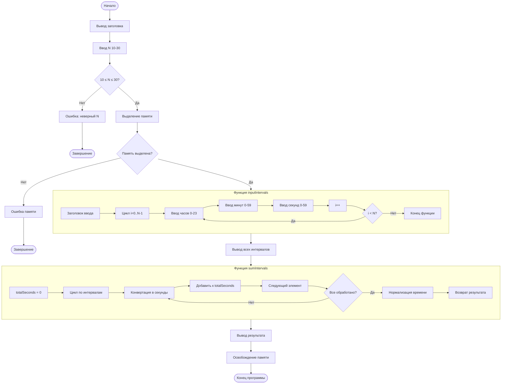

# animated-octo-waffle
# Блок-схема программы мониторинга пиковой нагрузки портала

## Описание программы
Программа суммирует N интервалов времени (10 ≤ N ≤ 30) и вычисляет общее время работы портала.

## Диаграмма алгоритма

