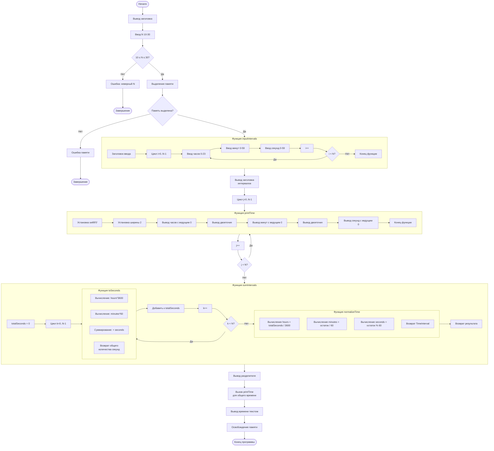

# Блок-схема программы мониторинга пиковой нагрузки портала

## Описание программы
Программа суммирует N интервалов времени (10 ≤ N ≤ 30) и вычисляет общее время работы портала.

## Диаграмма алгоритма



## Структура функций

### 1. Функция `toSeconds()`
```
Вход: TimeInterval (часы, минуты, секунды)
Алгоритм: часы*3600 + минуты*60 + секунды
Выход: общее время в секундах (int)
```

### 2. Функция `normalizeTime()`
```
Вход: totalSeconds (общее время в секундах)
Алгоритм:
  часы = totalSeconds / 3600
  минуты = (totalSeconds % 3600) / 60
  секунды = totalSeconds % 60
Выход: TimeInterval (нормализованное время)
```

### 3. Функция `printTime()`
```
Вход: TimeInterval (часы, минуты, секунды)
Алгоритм:
  1. Установить fill = '0'
  2. Для каждого компонента установить width = 2
  3. Вывести в формате: HH:MM:SS
Выход: форматированный вывод на экран
```

### 4. Функция `inputIntervals()`
```
Вход: массив TimeInterval, количество N
Алгоритм: цикл ввода с проверкой диапазонов
Выход: заполненный массив интервалов
```

### 5. Функция `sumIntervals()`
```
Вход: массив TimeInterval, количество N
Алгоритм:
  1. Преобразовать все интервалы в секунды (toSeconds)
  2. Суммировать все секунды
  3. Нормализовать результат (normalizeTime)
Выход: общее время как TimeInterval
```

## Последовательность выполнения
1. Ввод и проверка N
2. Выделение памяти
3. Ввод всех интервалов
4. Вывод введенных данных
5. Суммирование времени
6. Вывод результата
7. Освобождение памяти
